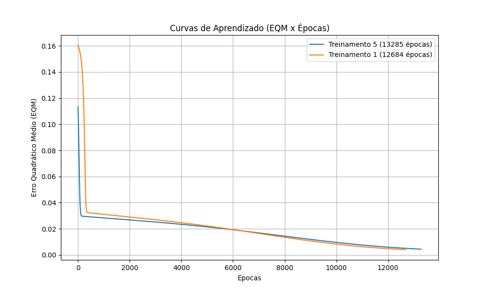

# Resolução: Atividade de Laboratório (PMC1)

**Disciplina:** Lab. Inteligência Artificial
**Data:** 13/05/2026

---

## 2. Resultados Finais dos Treinamentos (Tabela 1)

A tabela abaixo resume os resultados de 5 treinamentos executados com pesos iniciais aleatórios no intervalo [0, 1), utilizando taxa de aprendizado η = 0.1, precisão de 10⁻⁶ e função de ativação sigmóide para todos os neurônios.

| Treinamento | Erro Quadrático Médio (EQM) | Número de Épocas |
| :--- | :--- | :--- |
| 1º (T1) | 0.004048 | 12.684 |
| 2º (T2) | 0.004200 | 12.085 |
| 3º (T3) | 0.004100 | 12.049 |
| 4º (T4) | 0.004324 | 12.007 |
| 5º (T5) | 0.004408 | 13.285 |

---

## 3. Gráficos de Erro Quadrático Médio (Curvas de Aprendizado)

Os dois treinamentos que demandaram o maior número de épocas para atingir a convergência foram o **T5 (13.285 épocas)** e o **T1 (12.684 épocas)**. O gráfico do Erro Quadrático Médio (EQM) em função das épocas de treinamento foi gerado e salvo como `curvas_aprendizado.png` na pasta PMC.

---

## 4. Análise da Variação do Erro e do Número de Épocas

**Explicação detalhada:**
O algoritmo *Backpropagation* (Regra Delta Generalizada) é uma técnica baseada no método do gradiente descendente. Cada vez que a rede neural é treinada, os pesos sinápticos e os limiares (bias) são inicializados de forma aleatória e independente. Isso significa que, a cada novo treinamento, a rede "pousa" em um ponto de partida diferente dentro do complexo espaço multidimensional (superfície) de erro da função de custo.

Ao iniciar em coordenadas diferentes, o caminho traçado pelo gradiente até um ponto de mínimo será invariavelmente diferente. Por este motivo:
1. **O número de épocas varia:** Dependendo de quão distante o ponto inicial aleatório está de um ponto de mínimo e da topografia dessa região na superfície de erro, a rede precisará de mais ou menos iterações (épocas) para atingir o limiar de parada (precisão de 10⁻⁶).
2. **O Erro Quadrático Médio varia:** Como o espaço de erro muitas vezes não é convexo, a rede pode convergir para mínimos locais diferentes em execuções distintas. Mesmo ao atingir o mesmo vale (mínimo global), o critério de parada permite que o algoritmo encerre o treinamento em pontos marginalmente distintos onde a variação do erro tornou-se infinitesimal, resultando em valores finais de EQM pequenos, porém não idênticos.

---

## 5. Validação da Rede (Tabela 2)

A aplicação do conjunto de teste (validação) contendo 20 amostras inéditas forneceu os resultados consolidados na tabela abaixo:

| Amostra | x1 | x2 | x3 | d | yrede (T1) | yrede (T2) | yrede (T3) | yrede (T4) | yrede (T5) |
| :--- | :--- | :--- | :--- | :--- | :--- | :--- | :--- | :--- | :--- |
| 1 | 0.0611 | 0.2860 | 0.7464 | 0.4831 | 0.3814 | 0.3967 | 0.3915 | 0.3999 | 0.3929 |
| 2 | 0.5102 | 0.7464 | 0.0860 | 0.5965 | 0.7485 | 0.7512 | 0.7493 | 0.7502 | 0.7451 |
| 3 | 0.0004 | 0.6916 | 0.5006 | 0.5318 | 0.5939 | 0.6134 | 0.6078 | 0.6228 | 0.5972 |
| 4 | 0.9430 | 0.4476 | 0.2648 | 0.6843 | 0.7312 | 0.7197 | 0.7227 | 0.7143 | 0.7267 |
| 5 | 0.1399 | 0.1610 | 0.2477 | 0.2872 | 0.3390 | 0.3515 | 0.3446 | 0.3472 | 0.3518 |
| 6 | 0.6423 | 0.3229 | 0.8567 | 0.7663 | 0.5954 | 0.5849 | 0.5902 | 0.5849 | 0.5944 |
| 7 | 0.6492 | 0.0007 | 0.6422 | 0.5666 | 0.4123 | 0.3988 | 0.4037 | 0.3901 | 0.4171 |
| 8 | 0.1818 | 0.5078 | 0.9046 | 0.6601 | 0.5499 | 0.5605 | 0.5588 | 0.5690 | 0.5537 |
| 9 | 0.7382 | 0.2647 | 0.1916 | 0.5427 | 0.5940 | 0.5786 | 0.5857 | 0.5764 | 0.5923 |
| 10 | 0.3879 | 0.1307 | 0.8656 | 0.5836 | 0.4002 | 0.3993 | 0.4000 | 0.3964 | 0.4079 |
| 11 | 0.1903 | 0.6523 | 0.7820 | 0.6950 | 0.6309 | 0.6425 | 0.6389 | 0.6486 | 0.6319 |
| 12 | 0.8401 | 0.4490 | 0.2719 | 0.6790 | 0.7091 | 0.6990 | 0.7017 | 0.6950 | 0.7053 |
| 13 | 0.0029 | 0.3264 | 0.2476 | 0.2956 | 0.3851 | 0.4032 | 0.3973 | 0.4082 | 0.3970 |
| 14 | 0.7088 | 0.9342 | 0.2763 | 0.7742 | 0.8256 | 0.8252 | 0.8270 | 0.8231 | 0.8194 |
| 15 | 0.1283 | 0.1882 | 0.7253 | 0.4662 | 0.3497 | 0.3623 | 0.3562 | 0.3599 | 0.3621 |
| 16 | 0.8882 | 0.3077 | 0.8931 | 0.8093 | 0.6598 | 0.6426 | 0.6490 | 0.6376 | 0.6561 |
| 17 | 0.2225 | 0.9182 | 0.7820 | 0.7581 | 0.7507 | 0.7601 | 0.7564 | 0.7600 | 0.7475 |
| 18 | 0.1957 | 0.8423 | 0.3085 | 0.5826 | 0.7177 | 0.7287 | 0.7243 | 0.7304 | 0.7158 |
| 19 | 0.9991 | 0.5914 | 0.3933 | 0.7938 | 0.7861 | 0.7789 | 0.7806 | 0.7740 | 0.7808 |
| 20 | 0.2299 | 0.1524 | 0.7353 | 0.5012 | 0.3618 | 0.3695 | 0.3656 | 0.3661 | 0.3728 |
| **Erro Rel. Méd. (%)** | - | - | - | - | **5.6740** | **6.8233** | **6.5383** | **7.6677** | **6.6327** |
| **Variância (%)** | - | - | - | - | **42.3667** | **63.1587** | **53.3477** | **63.9024** | **57.2124** |

---

## 6. Conclusão da Melhor Configuração

Baseado nas métricas apresentadas na tabela de validação acima, a configuração final de treinamento que ofereceu a melhor capacidade de generalização para o sistema de ressonância magnética foi o **Treinamento 1 (T1)**. 

Essa conclusão fundamenta-se em dois pontos principais:
1. **Menor Erro Relativo Médio:** T1 obteve `5.6740%`, que é o menor erro percentual médio na previsão da energia absorvida para novos dados não apresentados no treinamento.
2. **Menor Variância:** A variância dos erros de T1 foi a menor observada (`42.3667%`). Isso atesta que as predições do modelo T1 são mais estáveis e consistentes, evitando grandes discrepâncias entre uma predição e outra, comportando-se de forma mais confiável em todo o espectro das amostras de teste.
