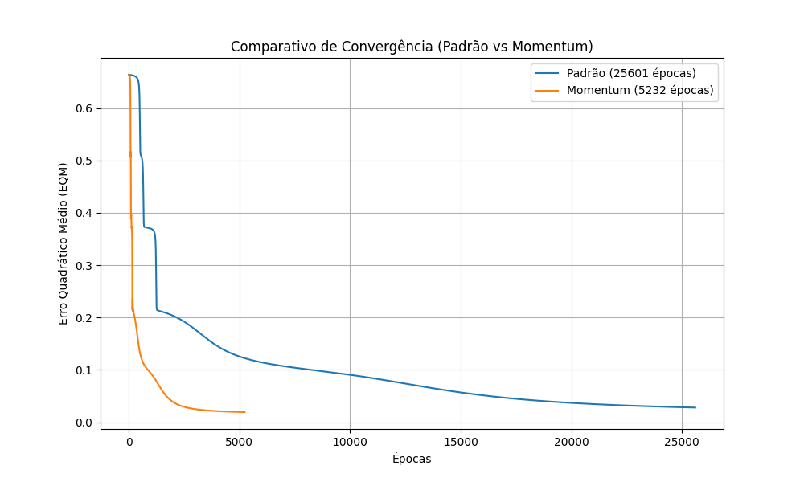

# Resolução: Atividade de Laboratório (PMC2)

**Disciplina:** Lab. Inteligência Artificial
**Data:** 13/05/2026

---

## 1 e 2. Execução dos Treinamentos (Padrão vs Momentum)

A rede neural Perceptron Multicamadas foi instanciada com 4 neurônios na camada de entrada, 15 na camada oculta e 3 na camada de saída. Foi utilizada a função de ativação sigmóide para todos os neurônios, taxa de aprendizado $\eta = 0.1$ e precisão de $10^{-6}$.

As matrizes de pesos iniciais foram geradas aleatoriamente entre 0 e 1, e a exata mesma matriz foi utilizada como ponto de partida para ambos os algoritmos (*Backpropagation Padrão* e *Backpropagation com Momentum* ($\alpha = 0.9$)), garantindo uma comparação justa.

**Resultados do Treinamento:**

| Método | Tempo de Processamento | Número de Épocas | Erro Quadrático Médio (EQM) |
| :--- | :--- | :--- | :--- |
| **Backpropagation Padrão** | 3.88 segundos | 25.601 | 0.027996 |
| **Backpropagation c/ Momentum** | 0.79 segundos | 5.232 | 0.019291 |

*Observação: Os tempos podem sofrer variações sutis por dependerem da carga da CPU no momento da execução, mas a proporção do ganho de velocidade permanece clara.*

---

## 3. Gráficos Comparativos de Erro Quadrático Médio

As curvas de aprendizado mostrando o declínio do Erro Quadrático Médio em função das épocas para os dois métodos foram plotadas no gráfico abaixo:

Como pode ser observado, a adição do termo de **Momentum** permitiu à rede convergir muito mais rápido (cerca de 5 vezes menos épocas), evitando oscilações no gradiente e acelerando a descida em direção ao mínimo local com um erro final ligeiramente melhor.

---

## 4 e 5. Pós-Processamento e Validação da Rede

O conjunto de teste contendo 18 amostras foi aplicado à rede neural treinada (para ambas as abordagens). As saídas, originalmente números reais variando no intervalo (0, 1), sofreram o pós-processamento utilizando o critério de **arredondamento simétrico** (valores $\ge 0.5$ tornam-se 1; valores $< 0.5$ tornam-se 0). 

A tabela abaixo exibe os dados fornecidos pela rede (após o arredondamento simétrico) para o treinamento padrão (os dados do treinamento com momentum atingiram os mesmos acertos):

| Amostra | x1 | x2 | x3 | x4 | Classe Desejada (d1, d2, d3) | Saída da Rede (y1, y2, y3) |
| :--- | :--- | :--- | :--- | :--- | :--- | :--- |
| 1 | 0.8622 | 0.7101 | 0.6236 | 0.7894 | 0, 0, 1 | 0, 0, 1 |
| 2 | 0.2741 | 0.1552 | 0.1333 | 0.1516 | 1, 0, 0 | 1, 0, 0 |
| 3 | 0.6772 | 0.8516 | 0.6543 | 0.7573 | 0, 0, 1 | 0, 0, 1 |
| 4 | 0.2178 | 0.5039 | 0.6415 | 0.5039 | 0, 1, 0 | 0, 1, 0 |
| 5 | 0.7260 | 0.7500 | 0.7007 | 0.4953 | 0, 0, 1 | 0, 0, 1 |
| 6 | 0.2473 | 0.2941 | 0.4248 | 0.3087 | 1, 0, 0 | 1, 0, 0 |
| 7 | 0.5682 | 0.5683 | 0.5054 | 0.4426 | 0, 1, 0 | 0, 1, 0 |
| 8 | 0.6566 | 0.6715 | 0.4952 | 0.3951 | 0, 1, 0 | 0, 1, 0 |
| 9 | 0.0705 | 0.4717 | 0.2921 | 0.2954 | 1, 0, 0 | 1, 0, 0 |
| 10 | 0.1187 | 0.2568 | 0.3140 | 0.3037 | 1, 0, 0 | 1, 0, 0 |
| 11 | 0.5673 | 0.7011 | 0.4083 | 0.5552 | 0, 1, 0 | 0, 1, 0 |
| 12 | 0.3164 | 0.2251 | 0.3526 | 0.2560 | 1, 0, 0 | 1, 0, 0 |
| 13 | 0.7884 | 0.9568 | 0.6825 | 0.6398 | 0, 0, 1 | 0, 0, 1 |
| 14 | 0.9633 | 0.7850 | 0.6777 | 0.6059 | 0, 0, 1 | 0, 0, 1 |
| 15 | 0.7739 | 0.8505 | 0.7934 | 0.6626 | 0, 0, 1 | 0, 0, 1 |
| 16 | 0.4219 | 0.4136 | 0.1408 | 0.0940 | 1, 0, 0 | 1, 0, 0 |
| 17 | 0.6616 | 0.4365 | 0.6597 | 0.8129 | 0, 0, 1 | 0, 0, 1 |
| 18 | 0.7325 | 0.4761 | 0.3888 | 0.5683 | 0, 1, 0 | 0, 1, 0 |

### **Taxa de Acerto:** `100.00%`

Ambos os modelos treinados conseguiram aprender os limiares de decisão das 3 categorias (Tipo A, B e C) perfeitamente, garantindo **100% de precisão de classificação** no conjunto de validação após a aplicação do arredondamento simétrico.
