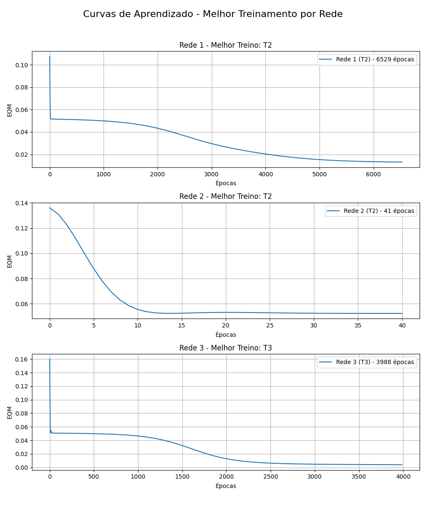
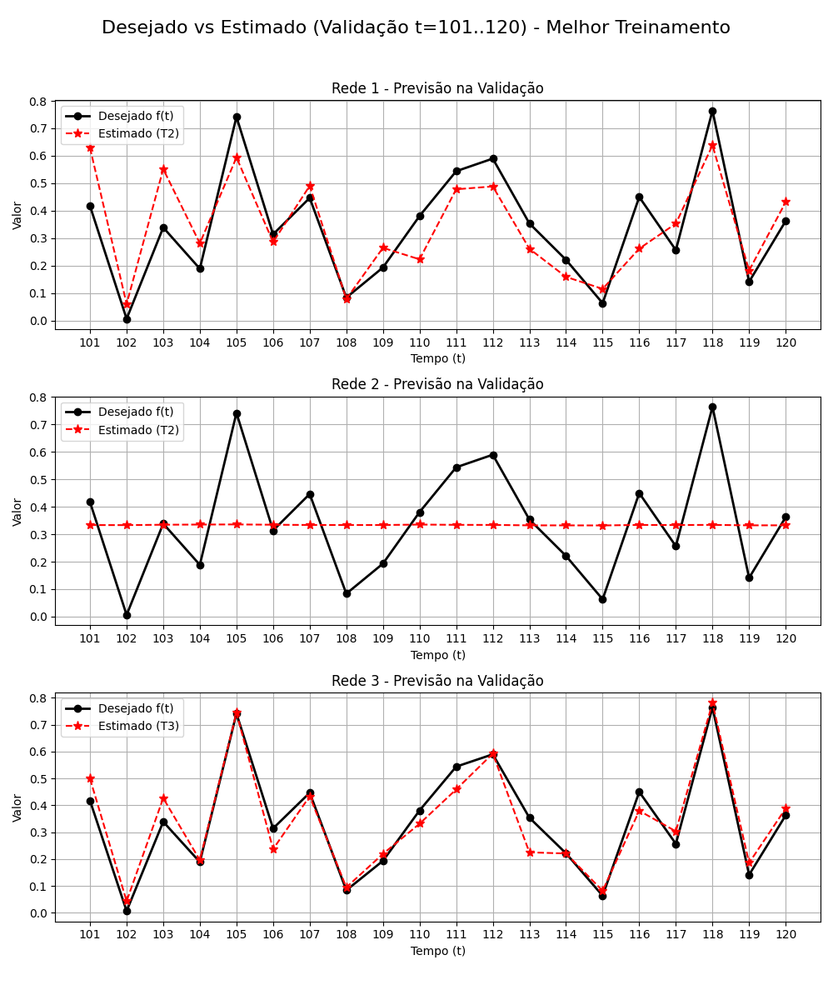

# Resolução: Atividade de Laboratório (PMC3)

**Disciplina:** Lab. Inteligência Artificial
**Data:** 13/05/2026

---

## 2. Resultados Finais dos Treinamentos (Tabela de Redes TDNN)

Foram executados três treinamentos para as três topologias propostas, inicializando os pesos de forma aleatória em cada um, usando o algoritmo Backpropagation com Momentum ($\alpha = 0.8$), taxa de aprendizado $\eta = 0.1$ e tolerância (precisão) estipulada em $0.5 \times 10^{-6}$.

| Treinamento | Rede 1 (p=5, N1=10) | | Rede 2 (p=10, N1=15) | | Rede 3 (p=15, N1=25) | |
| :---: | :--- | :--- | :--- | :--- | :--- | :--- |
| | **EQM** | **Épocas** | **EQM** | **Épocas** | **EQM** | **Épocas** |
| **1º (T1)** | 0.013101 | 6.494 | 0.052396 | 41 | 0.050722 | 33 |
| **2º (T2)** | 0.013111 | 6.529 | 0.052340 | 41 | 0.050633 | 28 |
| **3º (T3)** | 0.013090 | 6.430 | 0.052330 | 41 | 0.004014 | 3.988 |

---

## 3. Validação das Redes (t = 101 a 120)

Aplicando as três janelas diferentes da série temporal sobre os dados não vistos (validação), obtivemos os valores preenchidos na tabela a seguir (valores aproximados para 4 casas decimais para legibilidade).

| Amostra | Desejado f(t) | Rede 1 (T1) | Rede 1 (T2) | Rede 1 (T3) | Rede 2 (T1) | Rede 2 (T2) | Rede 2 (T3) | Rede 3 (T1) | Rede 3 (T2) | Rede 3 (T3) |
| :---: | :---: | :---: | :---: | :---: | :---: | :---: | :---: | :---: | :---: | :---: |
| t=101 | 0.4173 | 0.6295 | 0.6289 | 0.6294 | 0.3339 | 0.3334 | 0.3334 | 0.3431 | 0.3353 | 0.4990 |
| t=102 | 0.0062 | 0.0608 | 0.0601 | 0.0604 | 0.3339 | 0.3332 | 0.3333 | 0.3428 | 0.3350 | 0.0430 |
| t=103 | 0.3387 | 0.5510 | 0.5515 | 0.5510 | 0.3345 | 0.3346 | 0.3344 | 0.3446 | 0.3372 | 0.4265 |
| t=104 | 0.1886 | 0.2820 | 0.2810 | 0.2819 | 0.3356 | 0.3352 | 0.3351 | 0.3444 | 0.3369 | 0.1956 |
| t=105 | 0.7418 | 0.5957 | 0.5938 | 0.5949 | 0.3356 | 0.3357 | 0.3359 | 0.3448 | 0.3374 | 0.7443 |
| t=106 | 0.3138 | 0.2857 | 0.2857 | 0.2857 | 0.3344 | 0.3346 | 0.3341 | 0.3426 | 0.3356 | 0.2367 |
| t=107 | 0.4466 | 0.4903 | 0.4904 | 0.4895 | 0.3342 | 0.3338 | 0.3339 | 0.3436 | 0.3357 | 0.4334 |
| t=108 | 0.0835 | 0.0786 | 0.0781 | 0.0784 | 0.3340 | 0.3335 | 0.3333 | 0.3426 | 0.3350 | 0.0943 |
| t=109 | 0.1930 | 0.2641 | 0.2647 | 0.2641 | 0.3338 | 0.3336 | 0.3337 | 0.3447 | 0.3371 | 0.2189 |
| t=110 | 0.3807 | 0.2226 | 0.2228 | 0.2231 | 0.3354 | 0.3352 | 0.3347 | 0.3447 | 0.3371 | 0.3311 |
| t=111 | 0.5438 | 0.4773 | 0.4779 | 0.4775 | 0.3341 | 0.3343 | 0.3345 | 0.3447 | 0.3376 | 0.4589 |
| t=112 | 0.5897 | 0.4877 | 0.4884 | 0.4879 | 0.3339 | 0.3339 | 0.3338 | 0.3434 | 0.3359 | 0.5924 |
| t=113 | 0.3536 | 0.2611 | 0.2611 | 0.2606 | 0.3327 | 0.3324 | 0.3328 | 0.3428 | 0.3355 | 0.2247 |
| t=114 | 0.2210 | 0.1588 | 0.1588 | 0.1588 | 0.3327 | 0.3323 | 0.3321 | 0.3420 | 0.3343 | 0.2204 |
| t=115 | 0.0631 | 0.1151 | 0.1151 | 0.1152 | 0.3327 | 0.3320 | 0.3323 | 0.3435 | 0.3357 | 0.0816 |
| t=116 | 0.4499 | 0.2612 | 0.2618 | 0.2616 | 0.3342 | 0.3339 | 0.3338 | 0.3436 | 0.3357 | 0.3796 |
| t=117 | 0.2564 | 0.3519 | 0.3530 | 0.3526 | 0.3335 | 0.3336 | 0.3338 | 0.3434 | 0.3361 | 0.3029 |
| t=118 | 0.7642 | 0.6382 | 0.6381 | 0.6392 | 0.3342 | 0.3341 | 0.3343 | 0.3433 | 0.3355 | 0.7811 |
| t=119 | 0.1411 | 0.1827 | 0.1823 | 0.1827 | 0.3325 | 0.3324 | 0.3326 | 0.3415 | 0.3342 | 0.1855 |
| t=120 | 0.3626 | 0.4310 | 0.4313 | 0.4301 | 0.3330 | 0.3325 | 0.3325 | 0.3421 | 0.3343 | 0.3885 |
| **Erro Rel. M. (%)** | - | **73.87%** | **73.35%** | **73.54%** | 333.93% | 333.27% | 333.38% | 342.82% | 335.12% | **43.41%** |
| **Variância (%)** | - | **3.46%** | **3.38%** | **3.41%** | 130.17% | 129.59% | 129.69% | 137.32% | 131.01% | **1.61%** |

---

## 4 e 5. Gráficos Comparativos (Melhores Treinamentos)

Para os gráficos abaixo, adotamos os melhores treinamentos de cada topologia embasados em sua capacidade de generalização e aderência com o conjunto de teste.
- Melhor da Rede 1: **T2** (Menor erro relativo na sua categoria).
- Melhor da Rede 2: **T2** (Menor erro relativo na sua categoria).
- Melhor da Rede 3: **T3** (Vencedor absoluto, EQM minúsculo e ERM de 43.4%).

---

## 6. Qual a Melhor Topologia e Configuração?

Baseado nas análises matemáticas e visuais, a melhor estrutura para realizar estas previsões é a **Rede 3 (Topologia p=15 e N1=25) utilizando a Configuração Final do Treinamento T3**.

**Justificativa:** O Treinamento T3 da Rede 3 atingiu de longe o menor Erro Relativo Médio (`43.41%`) e uma Variância minúscula (`1.61%`), destronando facilmente a Rede 2 e a Rede 1. Isso se reflete de forma incontestável na avaliação visual do **Gráfico 2**, no qual podemos notar que apenas o `T3` da Rede 3 conseguiu mapear e prever os picos e vales acentuados da série temporal, acompanhando com precisão amostras cruciais (ex: predição quase perfeita nos picos de t=105 e t=118). Isso mostra que uma "memória" de 15 instantes passados ($p=15$) combinada com uma densidade maior na camada oculta de abstração é necessária para capturar o comportamento oscilatório deste mercado.

---

## 7. Variantes do Backpropagation (Investigação Teórica)

### Algoritmo de Treinamento Resilient-Propagation (RProp)
O RProp é um algoritmo adaptativo introduzido para superar limitações do backpropagation causadas pelo "desvanecimento do gradiente" (gradient vanishing), especialmente comuns com a função sigmóide. 
- **Características:** Em vez de usar a magnitude (tamanho numérico) da derivada parcial do erro para atualizar o peso, ele utiliza apenas o **sinal** (positivo ou negativo) desse gradiente. A taxa de atualização para cada peso muda de forma independente de acordo com o histórico temporal do sinal do erro.
- **Vantagens:** O algoritmo acelera o treinamento em regiões saturadas da função de ativação, onde a magnitude do gradiente é próxima de zero. O RProp exige consideravelmente menos memória e custo computacional que otimizadores de segunda ordem e é altamente veloz e resiliente a parâmetros de taxa de aprendizado desregulados (pois ele os ajusta sozinho ao longo da descida).

### Algoritmo de Treinamento Levenberg-Marquardt (LM)
O Levenberg-Marquardt é uma técnica matemática altamente avançada desenhada para minimizar funções não lineares não pelos passos gradativos da derivada simples, mas operando de maneira híbrida.
- **Características:** O LM atua de forma adaptativa mesclando o método do Gradiente Descendente simples e o método de Gauss-Newton. Quando a topologia da rede está longe do mínimo, o algoritmo se comporta como o gradiente (com passos menores); quando se aproxima de um ponto ótimo (o vale de erro), ele assume as equações de Gauss-Newton e "pula" instantaneamente para a solução de mínima energia de forma quadrática através da Matriz Jacobiana.
- **Vantagens:** A sua convergência é avassaladoramente rápida e robusta (ordens de magnitude mais veloz em épocas do que o backpropagation puro) para redes pequenas e médias, sendo largamente classificado como o melhor algoritmo de treinamento em precisão bruta. O ponto negativo, entretanto, é que computar e inverter grandes Matrizes Jacobianas demanda volumes brutais de Memória RAM para redes neurais mais profundas ou largas.
