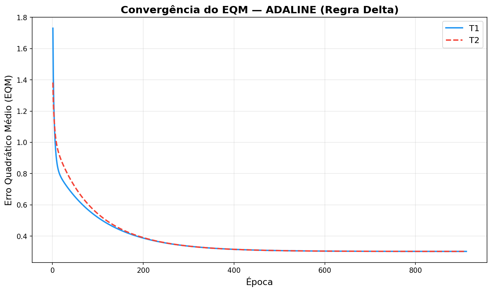

# Rede ADALINE — Regra Delta: Respostas da Atividade

## 1. Configuração da Rede

| Parâmetro              | Valor               |
|------------------------|---------------------|
| Tipo de rede           | ADALINE              |
| Regra de aprendizado   | Regra Delta          |
| Entradas               | x1, x2, x3, x4      |
| Bias (x0)              | −1                   |
| Taxa de aprendizado (η)| 0.0025               |
| Precisão (ε)           | 10⁻⁶                |
| Ativação               | Degrau bipolar       |

**Função de ativação degrau bipolar:**

$$
y = \begin{cases} +1 & \text{se } u \geq 0 \\ -1 & \text{se } u < 0 \end{cases}
$$

**Regra Delta (atualização de pesos):**

$$
w(t+1) = w(t) + \eta \cdot (d_i - u_i) \cdot x_i
$$

**Critério de parada:**

$$
|EQM_{atual} - EQM_{anterior}| < \varepsilon
$$

---

## 2. Saída 1 — Tabela de Pesos dos 5 Treinamentos

| Treinamento | w0_inicial | w1_inicial | w2_inicial | w3_inicial | w4_inicial | w0_final  | w1_final | w2_final | w3_final  | w4_final  | Épocas |
|:-----------:|:----------:|:----------:|:----------:|:----------:|:----------:|:---------:|:--------:|:--------:|:---------:|:---------:|:------:|
| T1          | 0.773956   | 0.438878   | 0.858598   | 0.697368   | 0.094177   | −1.813032 | 1.312925 | 1.642351 | −0.427516 | −1.177802 | 912    |
| T2          | 0.682352   | 0.053821   | 0.220360   | 0.184372   | 0.175906   | −1.813053 | 1.312837 | 1.642245 | −0.427715 | −1.177743 | 910    |
| T3          | 0.625095   | 0.897214   | 0.775686   | 0.225207   | 0.300166   | −1.813116 | 1.312896 | 1.642339 | −0.427663 | −1.177801 | 890    |
| T4          | 0.675831   | 0.214323   | 0.309452   | 0.799466   | 0.995802   | −1.813161 | 1.312914 | 1.642374 | −0.427674 | −1.177825 | 941    |
| T5          | 0.506031   | 0.565092   | 0.511916   | 0.972186   | 0.614903   | −1.813040 | 1.312926 | 1.642354 | −0.427524 | −1.177804 | 925    |

### Observações:
- Todos os 5 treinamentos convergiram para pesos finais **muito similares**, demonstrando a estabilidade da solução.
- O número de épocas variou de **890 (T3)** a **941 (T4)**, dependendo dos pesos iniciais.
- O EQM final convergiu para aproximadamente **0.302** em todos os treinamentos.

---

## 3. Saída 2 — Gráfico do EQM

O gráfico abaixo mostra a evolução do Erro Quadrático Médio (EQM) ao longo das épocas para os treinamentos T1 e T2:

### Análise do gráfico:
- Ambas as curvas (T1 e T2) apresentam um **decaimento rápido nas primeiras épocas**, seguido de uma convergência assintótica.
- A forma das curvas é característica do treinamento com Regra Delta: queda exponencial inicial que se estabiliza.
- Apesar de partirem de pesos iniciais diferentes, as duas curvas convergem para o **mesmo valor de EQM final**.

---

## 4. Saída 3 — Classificação do Conjunto de Teste

| Amostra | x1      | x2      | x3     | x4     | y(T1) | y(T2) | y(T3) | y(T4) | y(T5) |
|:-------:|:-------:|:-------:|:------:|:------:|:-----:|:-----:|:-----:|:-----:|:-----:|
| 1       |  0.9694 |  0.6909 | 0.4334 | 3.4965 | −1    | −1    | −1    | −1    | −1    |
| 2       |  0.5427 |  1.3832 | 0.6390 | 4.0352 | −1    | −1    | −1    | −1    | −1    |
| 3       |  0.6081 | −0.9196 | 0.5925 | 0.1016 | +1    | +1    | +1    | +1    | +1    |
| 4       | −0.1618 |  0.4694 | 0.2030 | 3.0117 | −1    | −1    | −1    | −1    | −1    |
| 5       |  0.1870 | −0.2578 | 0.6124 | 1.7749 | −1    | −1    | −1    | −1    | −1    |
| 6       |  0.4891 | −0.5276 | 0.4378 | 0.6439 | +1    | +1    | +1    | +1    | +1    |
| 7       |  0.3777 |  2.0149 | 0.7423 | 3.3932 | +1    | +1    | +1    | +1    | +1    |
| 8       |  1.1498 | −0.4067 | 0.2469 | 1.5866 | +1    | +1    | +1    | +1    | +1    |
| 9       |  0.9325 |  1.0950 | 1.0359 | 3.3591 | +1    | +1    | +1    | +1    | +1    |
| 10      |  0.5060 |  1.3317 | 0.9222 | 3.7174 | −1    | −1    | −1    | −1    | −1    |
| 11      |  0.0497 | −2.0656 | 0.6124 | −0.6585| −1    | −1    | −1    | −1    | −1    |
| 12      |  0.4004 |  3.5369 | 0.9766 | 5.3532 | +1    | +1    | +1    | +1    | +1    |
| 13      | −0.1874 |  1.3343 | 0.5374 | 3.2189 | −1    | −1    | −1    | −1    | −1    |
| 14      |  0.5060 |  1.3317 | 0.9222 | 3.7174 | −1    | −1    | −1    | −1    | −1    |
| 15      |  1.6375 | −0.7911 | 0.7537 | 0.5515 | +1    | +1    | +1    | +1    | +1    |

### Classificação resumida:
- **Válvula B (+1):** Amostras 3, 6, 7, 8, 9, 12, 15
- **Válvula A (−1):** Amostras 1, 2, 4, 5, 10, 11, 13, 14

### Observações:
- **Todos os 5 modelos concordam em 100% das classificações**, confirmando que a rede convergiu para a mesma solução independente dos pesos iniciais.
- As amostras 10 e 14 possuem os mesmos valores de entrada e recebem a mesma classificação (−1), como esperado.

---

## 5. Resumo dos Treinamentos

| Treinamento | Épocas | EQM Final   |
|:-----------:|:------:|:-----------:|
| T1          | 912    | 0.30199836  |
| T2          | 910    | 0.30199832  |
| T3          | 890    | 0.30199789  |
| T4          | 941    | 0.30199760  |
| T5          | 925    | 0.30199831  |

---

## 6. Conclusões

1. **Convergência robusta:** A ADALINE com Regra Delta convergiu em todos os 5 treinamentos, sempre para pesos finais praticamente idênticos, demonstrando que o problema possui uma solução única bem definida.

2. **Influência dos pesos iniciais:** Os pesos iniciais aleatórios afetam apenas o **número de épocas** necessário para convergência (variação de ~890 a ~941), mas não o resultado final.

3. **EQM residual:** O EQM final de ~0.302 indica que a separação linear não é perfeita — o que é esperado dado o ruído nos dados e a natureza linear da ADALINE.

4. **Consistência na classificação:** Os 5 modelos treinados produzem classificações **idênticas** para todas as 15 amostras de teste, reforçando a confiabilidade da solução.

---

## 7. Questão 5 — Por que os pesos finais permanecem praticamente inalterados apesar do número diferente de épocas?

Embora cada treinamento parta de pesos iniciais aleatórios distintos (gerando trajetos diferentes no espaço de pesos e, consequentemente, números de épocas variados), os **pesos finais convergem para valores praticamente idênticos**. Isso ocorre devido a três fatores fundamentais:

### 7.1. Superfície de erro convexa (solução única)

A ADALINE utiliza o **Erro Quadrático Médio (EQM)** como função de custo, que é uma função **quadrática** dos pesos. Funções quadráticas possuem uma **superfície de erro convexa** (formato de "bacia" ou paraboloide), o que garante a existência de um **único mínimo global**. Não importa de qual ponto inicial se parte — todos os caminhos de descida levam ao mesmo ponto ótimo.

### 7.2. A Regra Delta como gradiente descendente

A Regra Delta é uma implementação do **gradiente descendente estocástico**. A cada amostra, o ajuste $\Delta w = \eta \cdot (d_i - u_i) \cdot x_i$ move o vetor de pesos na direção que **reduz o erro**. Como a superfície é convexa:

- Pesos iniciais **mais distantes** do mínimo exigem **mais épocas** para alcançá-lo (ex: T4 com 941 épocas).
- Pesos iniciais **mais próximos** convergem **mais rapidamente** (ex: T3 com 890 épocas).
- Mas o **destino final** é sempre o mesmo mínimo global.

### 7.3. Critério de parada e precisão

O critério de parada ($|EQM_{atual} - EQM_{anterior}| < 10^{-6}$) é suficientemente rigoroso para garantir que todos os treinamentos só encerram quando estão **muito próximos do ponto ótimo**. Quando a diferença entre EQMs consecutivos é menor que $10^{-6}$, os pesos já estão essencialmente estabilizados no mínimo da superfície de erro.

### Analogia

Imagine 5 bolas lançadas de posições diferentes nas bordas de uma tigela. Cada bola percorre um caminho diferente e leva um tempo diferente para chegar ao fundo, mas **todas chegam ao mesmo ponto mais baixo** — o fundo da tigela. Os pesos iniciais são as posições de lançamento, as épocas são o tempo de trajeto, e o fundo da tigela é o mínimo global do EQM.

---

## Arquivos Gerados

| Arquivo             | Descrição                                             |
|---------------------|-------------------------------------------------------|
| `adaline_delta.py`  | Código-fonte completo da implementação                |
| `grafico_eqm.png`   | Gráfico do EQM × Época para T1 e T2                  |
| `RESPOSTAS_ADALINE.md` | Este documento com todas as respostas              |
