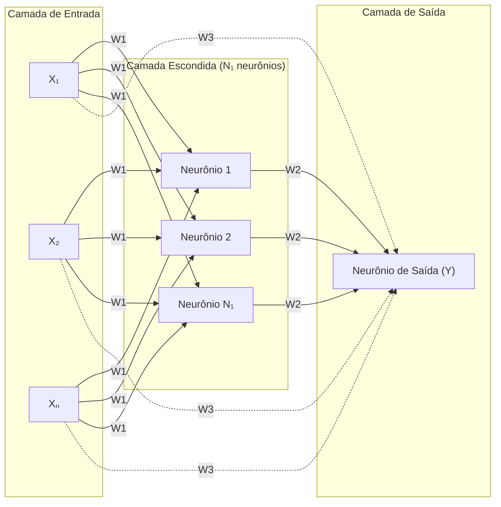

# Perceptron Multicamadas (PMC) — Algoritmo Backpropagation

## Descrição do Problema

Uma rede neural artificial do tipo **Perceptron Multicamadas (MLP)** foi projetada com **três camadas**, sendo:

| Camada               | Composição                          |
|----------------------|-------------------------------------|
| Camada de Entrada    | N sinais de entrada (X₁, X₂, ..., Xₙ) |
| Camada Escondida     | N₁ neurônios                        |
| Camada de Saída      | 1 neurônio                          |

**Conjunto de treinamento:** P padrões.

### Convenção das Matrizes de Pesos

| Matriz | Conexão                                  |
|--------|------------------------------------------|
| **W1** | Pesos entre a 1ª camada (entrada) e a 2ª camada (escondida) |
| **W2** | Pesos entre a 2ª camada (escondida) e a 3ª camada (saída)   |
| **W3** | Pesos entre a 1ª camada (entrada) e a 3ª camada (saída) — conexão direta (*shortcut*) |

> [!IMPORTANT]
> A topologia apresenta **conexões diretas** da camada de entrada para a camada de saída (matriz W3), além das conexões tradicionais via camada escondida. Isso caracteriza uma rede com **atalho** (*shortcut connections*).

---

## 1. Definição das Variáveis e Notação

### 1.1. Entradas e Saídas Desejadas

Para cada padrão de treinamento **p** (onde p = 1, 2, ..., P):

- **Vetor de entrada:**

$$
\mathbf{X}^{(p)} = [x_1^{(p)},\ x_2^{(p)},\ \dots,\ x_N^{(p)}]^T
$$

- **Saída desejada:**

$$
d^{(p)}
$$

### 1.2. Matrizes de Pesos

**Matriz W1** (entrada → escondida): Dimensão **N₁ × (N + 1)** (inclui bias)

$$
\mathbf{W1} = \begin{bmatrix}
w1_{1,0} & w1_{1,1} & w1_{1,2} & \cdots & w1_{1,N} \\
w1_{2,0} & w1_{2,1} & w1_{2,2} & \cdots & w1_{2,N} \\
\vdots   & \vdots   & \vdots   & \ddots & \vdots \\
w1_{N_1,0} & w1_{N_1,1} & w1_{N_1,2} & \cdots & w1_{N_1,N}
\end{bmatrix}
$$

Onde:
- $w1_{j,0}$ = peso do bias para o neurônio j da camada escondida
- $w1_{j,i}$ = peso da entrada $x_i$ para o neurônio j da camada escondida

**Matriz W2** (escondida → saída): Dimensão **1 × (N₁ + 1)** (inclui bias)

$$
\mathbf{W2} = [w2_{1,0},\ w2_{1,1},\ w2_{1,2},\ \cdots,\ w2_{1,N_1}]
$$

Onde:
- $w2_{1,0}$ = peso do bias para o neurônio de saída
- $w2_{1,j}$ = peso da saída do neurônio escondido j para o neurônio de saída

**Matriz W3** (entrada → saída, conexão direta): Dimensão **1 × N**

$$
\mathbf{W3} = [w3_{1,1},\ w3_{1,2},\ \cdots,\ w3_{1,N}]
$$

Onde:
- $w3_{1,i}$ = peso da entrada $x_i$ diretamente para o neurônio de saída

### 1.3. Função de Ativação

Utilizamos a função **sigmoide logística** (diferenciável, requisito do Backpropagation):

$$
g(u) = \frac{1}{1 + e^{-\beta u}}
$$

Cuja **derivada** é:

$$
g'(u) = \beta \cdot g(u) \cdot [1 - g(u)]
$$

Onde $\beta$ é um parâmetro de inclinação (tipicamente $\beta = 1$).

---

## 2. Fase Forward (Propagação Direta)

Para cada padrão de treinamento **p**, a rede processa os dados em duas etapas:

### 2.1. Cálculo da Camada Escondida

Para cada neurônio **j** da camada escondida (j = 1, 2, ..., N₁):

**Combinação linear (net):**

$$
u_j^{esc} = w1_{j,0} \cdot (-1) + \sum_{i=1}^{N} w1_{j,i} \cdot x_i^{(p)}
$$

**Saída do neurônio (após ativação):**

$$
Z_j = g(u_j^{esc})
$$

Em **notação matricial:**

$$
\mathbf{u}^{esc} = \mathbf{W1} \cdot \mathbf{\tilde{X}}^{(p)}
$$

$$
\mathbf{Z} = g(\mathbf{u}^{esc})
$$

Onde $\mathbf{\tilde{X}}^{(p)} = [-1,\ x_1^{(p)},\ x_2^{(p)},\ \dots,\ x_N^{(p)}]^T$ (vetor de entrada com bias).

### 2.2. Cálculo da Camada de Saída

O neurônio de saída recebe contribuições de **duas fontes**:
1. Saídas da camada escondida (via **W2**)
2. Entradas originais diretamente (via **W3**)

**Combinação linear (net):**

$$
u^{saida} = \underbrace{w2_{1,0} \cdot (-1) + \sum_{j=1}^{N_1} w2_{1,j} \cdot Z_j}_{\text{contribuição via W2}} + \underbrace{\sum_{i=1}^{N} w3_{1,i} \cdot x_i^{(p)}}_{\text{contribuição direta via W3}}
$$

**Saída da rede (após ativação):**

$$
Y = g(u^{saida})
$$

Em **notação matricial:**

$$
u^{saida} = \mathbf{W2} \cdot \mathbf{\tilde{Z}} + \mathbf{W3} \cdot \mathbf{X}^{(p)}
$$

Onde $\mathbf{\tilde{Z}} = [-1,\ Z_1,\ Z_2,\ \dots,\ Z_{N_1}]^T$ (vetor de saídas da camada escondida com bias).

---

## 3. Cálculo do Erro

Para cada padrão **p**, o erro é:

$$
e^{(p)} = d^{(p)} - Y^{(p)}
$$

O **Erro Quadrático Médio (EQM)** sobre todos os P padrões é:

$$
EQM = \frac{1}{P} \sum_{p=1}^{P} \left( e^{(p)} \right)^2 = \frac{1}{P} \sum_{p=1}^{P} \left( d^{(p)} - Y^{(p)} \right)^2
$$

---

## 4. Fase Backward (Retropropagação do Erro)

O objetivo é calcular os **gradientes** do erro em relação a cada peso para atualizar as matrizes W1, W2 e W3. A retropropagação aplica a **Regra da Cadeia** do cálculo diferencial.

### 4.1. Gradiente Local da Camada de Saída (δ de saída)

O gradiente local do neurônio de saída mede a "responsabilidade" deste neurônio pelo erro:

$$
\delta^{saida} = e^{(p)} \cdot g'(u^{saida})
$$

Expandindo a derivada da sigmoide:

$$
\delta^{saida} = (d^{(p)} - Y^{(p)}) \cdot \beta \cdot Y^{(p)} \cdot (1 - Y^{(p)})
$$

### 4.2. Gradiente Local da Camada Escondida (δ escondida)

Para cada neurônio **j** da camada escondida (j = 1, 2, ..., N₁):

$$
\delta_j^{esc} = g'(u_j^{esc}) \cdot \left( \delta^{saida} \cdot w2_{1,j} \right)
$$

Expandindo:

$$
\delta_j^{esc} = \beta \cdot Z_j \cdot (1 - Z_j) \cdot \delta^{saida} \cdot w2_{1,j}
$$

**Interpretação:** O erro é "retropropagado" da saída para cada neurônio escondido, ponderado pelo peso $w2_{1,j}$ que conecta o neurônio j à saída. A derivada $g'(u_j^{esc})$ modula o gradiente conforme a posição na curva sigmoide.

Em **notação matricial:**

$$
\boldsymbol{\delta}^{esc} = g'(\mathbf{u}^{esc}) \odot \left( \mathbf{W2}_{[sem\ bias]}^T \cdot \delta^{saida} \right)
$$

Onde $\odot$ denota o produto elemento a elemento (Hadamard).

---

## 5. Ajuste das Matrizes de Pesos

Com os gradientes locais calculados, os pesos são atualizados utilizando a **regra do gradiente descendente**.

### 5.1. Ajuste da Matriz W2 (escondida → saída)

$$
\Delta w2_{1,j} = \eta \cdot \delta^{saida} \cdot \tilde{Z}_j
$$

**Para cada peso individualmente:**

| Peso | Atualização |
|------|-------------|
| $w2_{1,0}$ (bias) | $w2_{1,0} \leftarrow w2_{1,0} + \eta \cdot \delta^{saida} \cdot (-1)$ |
| $w2_{1,1}$ | $w2_{1,1} \leftarrow w2_{1,1} + \eta \cdot \delta^{saida} \cdot Z_1$ |
| $w2_{1,2}$ | $w2_{1,2} \leftarrow w2_{1,2} + \eta \cdot \delta^{saida} \cdot Z_2$ |
| $\vdots$ | $\vdots$ |
| $w2_{1,N_1}$ | $w2_{1,N_1} \leftarrow w2_{1,N_1} + \eta \cdot \delta^{saida} \cdot Z_{N_1}$ |

Em **notação matricial:**

$$
\mathbf{W2}(t+1) = \mathbf{W2}(t) + \eta \cdot \delta^{saida} \cdot \mathbf{\tilde{Z}}^T
$$

### 5.2. Ajuste da Matriz W3 (entrada → saída, conexão direta)

$$
\Delta w3_{1,i} = \eta \cdot \delta^{saida} \cdot x_i^{(p)}
$$

**Para cada peso individualmente:**

| Peso | Atualização |
|------|-------------|
| $w3_{1,1}$ | $w3_{1,1} \leftarrow w3_{1,1} + \eta \cdot \delta^{saida} \cdot x_1^{(p)}$ |
| $w3_{1,2}$ | $w3_{1,2} \leftarrow w3_{1,2} + \eta \cdot \delta^{saida} \cdot x_2^{(p)}$ |
| $\vdots$ | $\vdots$ |
| $w3_{1,N}$ | $w3_{1,N} \leftarrow w3_{1,N} + \eta \cdot \delta^{saida} \cdot x_N^{(p)}$ |

Em **notação matricial:**

$$
\mathbf{W3}(t+1) = \mathbf{W3}(t) + \eta \cdot \delta^{saida} \cdot (\mathbf{X}^{(p)})^T
$$

> [!NOTE]
> A atualização de W3 usa o **mesmo gradiente local da saída** ($\delta^{saida}$) porque W3 conecta diretamente as entradas à saída. A diferença para W2 é que W3 é ponderada pelas entradas $x_i$ em vez das saídas dos neurônios escondidos $Z_j$.

### 5.3. Ajuste da Matriz W1 (entrada → escondida)

$$
\Delta w1_{j,i} = \eta \cdot \delta_j^{esc} \cdot \tilde{x}_i^{(p)}
$$

**Para cada neurônio j da camada escondida e cada entrada i:**

| Peso | Atualização |
|------|-------------|
| $w1_{j,0}$ (bias) | $w1_{j,0} \leftarrow w1_{j,0} + \eta \cdot \delta_j^{esc} \cdot (-1)$ |
| $w1_{j,1}$ | $w1_{j,1} \leftarrow w1_{j,1} + \eta \cdot \delta_j^{esc} \cdot x_1^{(p)}$ |
| $w1_{j,2}$ | $w1_{j,2} \leftarrow w1_{j,2} + \eta \cdot \delta_j^{esc} \cdot x_2^{(p)}$ |
| $\vdots$ | $\vdots$ |
| $w1_{j,N}$ | $w1_{j,N} \leftarrow w1_{j,N} + \eta \cdot \delta_j^{esc} \cdot x_N^{(p)}$ |

Em **notação matricial:**

$$
\mathbf{W1}(t+1) = \mathbf{W1}(t) + \eta \cdot \boldsymbol{\delta}^{esc} \cdot (\mathbf{\tilde{X}}^{(p)})^T
$$

---

## 6. Sequência Completa do Algoritmo Backpropagation

### Algoritmo passo a passo:

```
INICIALIZAÇÃO:
    Inicializar W1, W2 e W3 com valores aleatórios pequenos
    Definir taxa de aprendizado η
    Definir critério de parada (ε ou número máximo de épocas)

REPETIR (para cada época):
    EQM_epoca = 0

    PARA cada padrão p = 1, 2, ..., P:

        ┌─────────────────────────────────────────┐
        │ PASSO 1 — FORWARD (Propagação Direta)   │
        └─────────────────────────────────────────┘

        1.1. Apresentar X(p) à camada de entrada

        1.2. Camada Escondida:
             Para j = 1 até N₁:
                 u_j^esc  = w1_{j,0}·(-1) + Σ(i=1 até N) w1_{j,i}·x_i
                 Z_j      = g(u_j^esc)

        1.3. Camada de Saída:
             u^saida = w2_{1,0}·(-1) + Σ(j=1 até N₁) w2_{1,j}·Z_j
                     + Σ(i=1 até N) w3_{1,i}·x_i
             Y       = g(u^saida)

        1.4. Calcular erro:
             e(p) = d(p) - Y

        ┌─────────────────────────────────────────┐
        │ PASSO 2 — BACKWARD (Retropropagação)    │
        └─────────────────────────────────────────┘

        2.1. Gradiente local da saída:
             δ^saida = e(p) · g'(u^saida)
                     = (d(p) - Y) · β·Y·(1 - Y)

        2.2. Gradiente local da camada escondida:
             Para j = 1 até N₁:
                 δ_j^esc = g'(u_j^esc) · δ^saida · w2_{1,j}
                         = β·Z_j·(1 - Z_j) · δ^saida · w2_{1,j}

        ┌─────────────────────────────────────────┐
        │ PASSO 3 — ATUALIZAÇÃO DOS PESOS         │
        └─────────────────────────────────────────┘

        3.1. Atualizar W2 (escondida → saída):
             Para j = 0 até N₁:
                 w2_{1,j} = w2_{1,j} + η · δ^saida · Z̃_j

        3.2. Atualizar W3 (entrada → saída):
             Para i = 1 até N:
                 w3_{1,i} = w3_{1,i} + η · δ^saida · x_i

        3.3. Atualizar W1 (entrada → escondida):
             Para j = 1 até N₁:
                 Para i = 0 até N:
                     w1_{j,i} = w1_{j,i} + η · δ_j^esc · x̃_i

        EQM_epoca += (e(p))²

    FIM PARA

    EQM_epoca = EQM_epoca / P

ATÉ QUE |EQM_atual - EQM_anterior| < ε
```

---

## 7. Diagrama do Fluxo de Informação



**Legenda:**
- Setas sólidas → conexões tradicionais (W1 e W2)
- Setas tracejadas → conexões diretas / atalho (W3)

---

## 8. Resumo das Dimensões das Matrizes

| Matriz | Conexão | Dimensão | Nº de Pesos |
|:------:|:-------:|:--------:|:-----------:|
| **W1** | Entrada → Escondida | N₁ × (N + 1) | N₁ · (N + 1) |
| **W2** | Escondida → Saída   | 1 × (N₁ + 1) | N₁ + 1 |
| **W3** | Entrada → Saída     | 1 × N         | N |
| **Total** | — | — | **N₁·(N+1) + N₁ + 1 + N** |

---

## 9. Observações Importantes

### 9.1. Ordem de atualização dos pesos
Os pesos de W2 e W3 devem ser atualizados **antes** de W1 no mesmo padrão, pois os gradientes locais da camada escondida ($\delta_j^{esc}$) dependem dos pesos atuais de W2. Alternativamente, pode-se calcular **todos os gradientes primeiro** e depois atualizar todos os pesos simultaneamente.

### 9.2. Papel da conexão direta (W3)
A matriz W3 cria um **atalho** (*shortcut connection*) que permite à rede:
- Modelar componentes lineares da relação entrada-saída diretamente
- Facilitar o fluxo de gradiente durante o treinamento
- Melhorar a convergência em problemas onde parte da relação é linear

### 9.3. Bias
Cada camada neural (escondida e de saída) possui um **neurônio de bias** com entrada fixa igual a **−1** (conforme convenção do diagrama). O bias é incorporado nas matrizes W1 e W2 como a primeira coluna (índice 0).

### 9.4. Diferença entre W2 e W3 na retropropagação
Embora ambas W2 e W3 usem o mesmo $\delta^{saida}$ para atualização, elas são ponderadas por sinais diferentes:
- **W2** usa as saídas processadas da camada escondida ($Z_j$)
- **W3** usa as entradas brutas ($x_i$)

Isso reflete o fato de que W2 ajusta a contribuição das **features transformadas** (não-lineares), enquanto W3 ajusta a contribuição das **features originais** (lineares).
