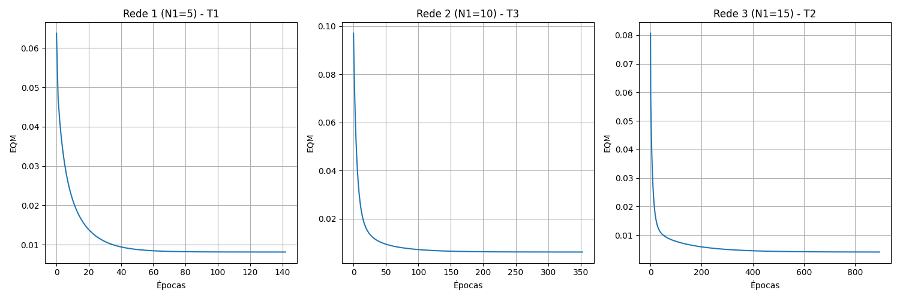

# Respostas - Trabalho RBF2

## 1. Resultados dos Treinamentos

| Treinamento | Rede 1 (N1=5) EQM | Rede 1 Épocas | Rede 2 (N1=10) EQM | Rede 2 Épocas | Rede 3 (N1=15) EQM | Rede 3 Épocas |
|---|---|---|---|---|---|---|
| 1º (T1) | 0.008139 | 142 | 0.006194 | 322 | 0.004090 | 901 |
| 2º (T2) | 0.008139 | 114 | 0.006194 | 383 | 0.004090 | 896 |
| 3º (T3) | 0.008139 | 130 | 0.006194 | 353 | 0.004090 | 930 |

## 2. Validação

| Amostra | $x_1$ | $x_2$ | $x_3$ | $d$ | Rede 1 (T1) | Rede 1 (T2) | Rede 1 (T3) | Rede 2 (T1) | Rede 2 (T2) | Rede 2 (T3) | Rede 3 (T1) | Rede 3 (T2) | Rede 3 (T3) |
|---|---|---|---|---|---|---|---|---|---|---|---|---|---|
| 01 | 0.5102 | 0.7464 | 0.0860 | 0.5965 | 0.6459 | 0.6459 | 0.6459 | 0.5817 | 0.5817 | 0.5817 | 0.5784 | 0.5784 | 0.5784 |
| 02 | 0.8401 | 0.4490 | 0.2719 | 0.6790 | 0.7526 | 0.7526 | 0.7526 | 0.6662 | 0.6662 | 0.6662 | 0.6375 | 0.6375 | 0.6375 |
| 03 | 0.1283 | 0.1882 | 0.7253 | 0.4662 | 0.5623 | 0.5622 | 0.5623 | 0.5159 | 0.5159 | 0.5160 | 0.5302 | 0.5302 | 0.5302 |
| 04 | 0.2299 | 0.1524 | 0.7353 | 0.5012 | 0.5712 | 0.5712 | 0.5712 | 0.5312 | 0.5312 | 0.5312 | 0.5356 | 0.5356 | 0.5356 |
| 05 | 0.3209 | 0.6229 | 0.5233 | 0.6810 | 0.6855 | 0.6856 | 0.6855 | 0.6617 | 0.6617 | 0.6617 | 0.6647 | 0.6647 | 0.6647 |
| 06 | 0.8203 | 0.0682 | 0.4260 | 0.5643 | 0.5742 | 0.5741 | 0.5743 | 0.5477 | 0.5477 | 0.5477 | 0.5447 | 0.5446 | 0.5446 |
| 07 | 0.3471 | 0.8889 | 0.1564 | 0.5875 | 0.5997 | 0.5996 | 0.5997 | 0.5774 | 0.5774 | 0.5774 | 0.5936 | 0.5936 | 0.5936 |
| 08 | 0.5762 | 0.8292 | 0.4116 | 0.7853 | 0.8447 | 0.8448 | 0.8447 | 0.7977 | 0.7977 | 0.7977 | 0.7453 | 0.7453 | 0.7453 |
| 09 | 0.9053 | 0.6245 | 0.5264 | 0.8506 | 0.9017 | 0.9019 | 0.9017 | 0.8891 | 0.8891 | 0.8891 | 0.8365 | 0.8365 | 0.8365 |
| 10 | 0.8149 | 0.0396 | 0.6227 | 0.6165 | 0.5790 | 0.5789 | 0.5791 | 0.6356 | 0.6356 | 0.6356 | 0.6944 | 0.6944 | 0.6944 |
| 11 | 0.1016 | 0.6382 | 0.3173 | 0.4957 | 0.4861 | 0.4861 | 0.4861 | 0.5093 | 0.5093 | 0.5093 | 0.5392 | 0.5392 | 0.5392 |
| 12 | 0.9108 | 0.2139 | 0.4641 | 0.6625 | 0.6418 | 0.6417 | 0.6419 | 0.6459 | 0.6459 | 0.6459 | 0.6017 | 0.6017 | 0.6017 |
| 13 | 0.2245 | 0.0971 | 0.6136 | 0.4402 | 0.4665 | 0.4666 | 0.4665 | 0.4330 | 0.4330 | 0.4330 | 0.4939 | 0.4939 | 0.4939 |
| 14 | 0.6423 | 0.3229 | 0.8567 | 0.7663 | 0.7071 | 0.7071 | 0.7072 | 0.7509 | 0.7509 | 0.7509 | 0.7435 | 0.7435 | 0.7435 |
| 15 | 0.5252 | 0.6529 | 0.5729 | 0.7893 | 0.8588 | 0.8590 | 0.8587 | 0.8321 | 0.8321 | 0.8321 | 0.7782 | 0.7782 | 0.7782 |
| **Erro Rel. Médio (%)** | | | | | 7.03 | 7.03 | 7.03 | 3.47 | 3.47 | 3.47 | 6.04 | 6.04 | 6.04 | 
| **Variância (%)** | | | | | 25.98 | 25.97 | 25.97 | 5.40 | 5.40 | 5.40 | 17.55 | 17.55 | 17.56 | 

## 3. Gráficos de EQM

## 4. Conclusão

A topologia mais adequada é a **Rede 2** com a configuração de treinamento **T2**, pois apresentou o menor erro relativo médio (3.47%) nos dados de validação, demonstrando melhor capacidade de generalização.
